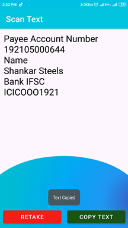

# Scan-Text
Scan Text App - A seamless, high-performing &amp; accessible library for OCR-related tasks .An Application for extracting text from scanned images of printed text documents.

## Features
- Crop
- Rotate
- Recognize Text
- Copy to clipboard
  
## Libraries
- [android-image-cropper](https://github.com/ArthurHub/Android-Image-Cropper): for image cropping.
- [Mobile Vision](https://developers.google.com/ml-kit/vision/text-recognition/android) : To Capture and Extract the Text

## Support
- Android 6.0+

## Planned Features

- **Backlog**     → a simple idea 

- **Ready**       → idea now is a possible feature waiting to be developed

- **In progress** → feature being developed

## Download Now 

- [Scan Text](https://mega.nz/file/SvIgRBgD#rnzfZmZNdxm49qAyQMZfcG6OqY_M6-nUIXXpfwpJziU)

## ScreenShots

